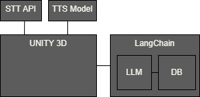

### 📑 보고서의 형식

1. 과제 배경 및 목표
	1. 과제 배경 및 현황
	2. 과제 필요성
	3. 과제 목표
2. 요구 조건 분석
3. 현실적 제약 사항 및 대책
4. 설계 문서
	1. 개발 언어
	2. 개발 환경
	3. 사용 장비
	4. 프로세스
5. 개발 일정 및 역할 분담
	1. 개발 일정
	2. 역할 분담

### ▶️  선정한 주제

#### ⚪ 하이브리드 지능형 가상캐릭터 개발
	- 인간형 가상캐릭터의 챗봇기반 대화지능 구축 (Embodied Conversational Agents)  
	- 사용자와 캐릭터간의 대화분석을 통한 실제 사람 개입 필요상황 검출  
	- 자연스러운 가상캐릭터 컨트롤 주체 변경(Computer to Human) 기법 연구개발

### ⚪  현재 아이디어
##### 전체적인 방향
- Speech-to-Text를 통한 음성인식 -> LLM 모델 -> Text-to-Speech

##### 1. 배경과 성격
   기본적으로 캐릭터에게 배경과 성격이 부여된다. 
   배경과 성격은 캐릭터의 옵션에서 채팅을 통해 변경시킬수 있다.

##### 2. TTS 목소리
   LLM을 통해 나온 대답을 사전에 학습시킨 목소리로 읽는다.
##### 3. 주변환경 상호작용
   LLM이 생성한 대화 내용을 통해 행동한다.
   ex) 거기 문 좀 닫아줘. - 알겠어 내가 닫아줄게(문을 닫으러 가는 행동)
   

### ▶️ 구성도

### ⚪ Speech-to-Text
1. Google-Cloud-Speech
### ⚪ Text-to-Speech
1. TTS 모델을 선정하고 목소리 적용 후 사용
### ⚪ LLM
1. Llama 3 8b instruct
2. gpt 3.5 turbo
3. 그 외 OpenSource Ko-LLM

### ⚪  구현 방법
##### 1. 배경과 성격
1. 프로그램 시작 전
	LLM에 대화 데이터셋을 파인튜닝한다.
	
	여기서 말하는 **대화 데이터셋**이란 다음과 같다.
	1. Input-Output 쌍으로 이루어진 대화 데이터셋
		ex) (밥 먹었어? - 네가 알 바야?)
	2. 여러 캐릭터의 대화 내용으로 X

	프로그램이 시작되기 전에 프롬프트 엔지니어링을 사용하여 캐릭터의 배경을 학습시킨다.

2. 프로그램 시작 후
	캐릭터 설정에서 말한 내용을 사전에 설정한 포맷에 맞게 변환하여 LLM에게 알려준다.
	ex) <\$배경 설정\$> 외향적으로 변경
##### 2. TTS 목소리
   Text-to-Speech에 원하는 목소리를 훈련시킨다.
   참고: [SCE-TTS: 내 목소리로 TTS 만들기 - 음성 학습 (v1) (youtube.com)](https://www.youtube.com/watch?v=e-BmK9VZzRM)
   
##### 3. 주변환경 상호작용

아래와 같이 구현한다.
1. 캐릭터가 주위를 걸어다닌다.
2. 캐릭터의 시야에 문(태그: 열기, 닫기)가 보인다. 해당 오브젝트의 정보를 DB에 저장한다.
3. 시야에 없으면 돌아다닌다.
4. 캐릭터의 시야에 물병(태그: 마시기)가 보인다. 해당 오브젝트의 정보를 DB에 저장한다.
5. 플레이어가 캐릭터에게 문을 닫으라고 말한다.
6. LLM을 통해 대답이 출력된다.
7. LocalNLP에 대답과 DB를 넣고 어떤 오브젝트들과 상호작용할지 결정한다. (LocalNLP: 문장과 관련된 아이템 추천. 쇼핑몰에서 자주 쓰임.)
8. 캐릭터의 행동 계획을 저장하는 Plan 배열에 행동들을 저장한다. ("문을 닫고, 물을 마셔"와 같은 행동을 할 수 있도록)
9. 캐릭터는 Plan에 따라 행동한다.

주변환경 상호작용의 로직은 아래의 깃허브와 논문을 통해 참고할수 있다.
파이썬 버전: [joonspk-research/generative_agents: Generative Agents: Interactive Simulacra of Human Behavior (github.com)](https://github.com/joonspk-research/generative_agents)
자바 버전: [nickm980/smallville: Generative Agents for video games. Based on Generative Agents: Interactive Simulacra of Human Behavior (github.com)](https://github.com/nickm980/smallville)
논문: [2304.03442 (arxiv.org)](https://arxiv.org/pdf/2304.03442)

===============================================================
아래는 참고용이다.
LLM, LangChain 사용한 튜토리얼: [비용 걱정 없는 Open Source LLM 업무 매뉴얼 QA 시스템 구현 - 랭체인(LangChain), 올라마(ollama), 구글 젬마(gemma) (youtube.com)](https://www.youtube.com/watch?v=GLM73CbEVaY&list=LL&index=4)
